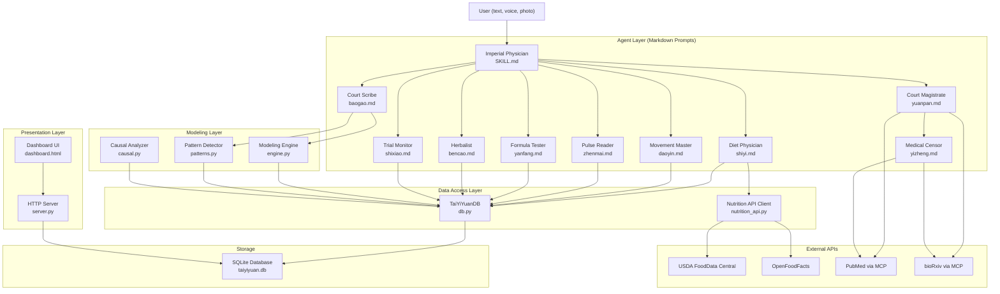
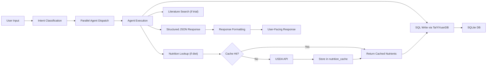
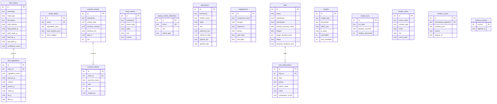
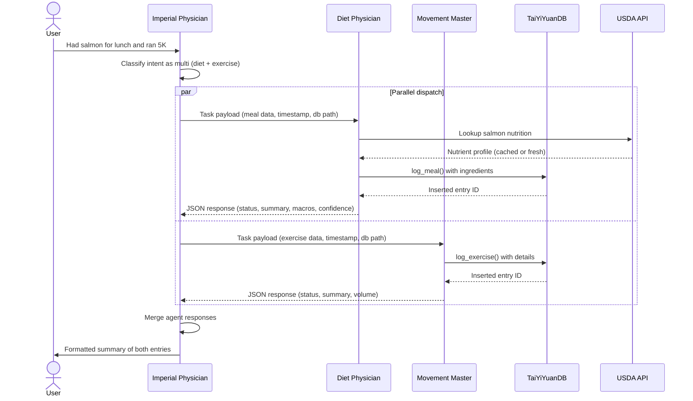
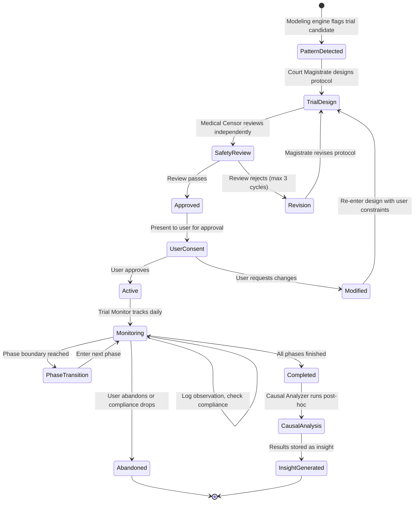
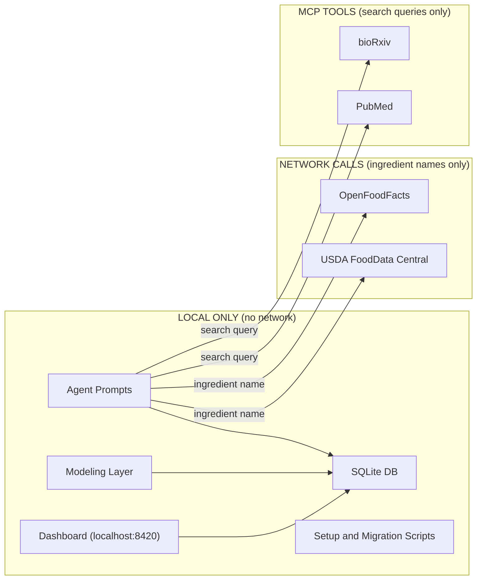

<p align="center">
  
</p>

<h1 align="center">Longevity OS</h1>
<p align="center"><b>Agentic Longevity OS · Works with Claude Code & OpenClaw</b></p>

<p align="center">
Your personal team of AI physicians that tracks your health,<br/>
finds hidden patterns across your data, searches the scientific literature,<br/>
and proposes rigorous self-experiments, then analyzes the results.<br/>
<b>10 markdown agent prompts + MCP tools. Runs on Claude Code, OpenClaw, or any MCP-compatible agent.</b>
</p>

<p align="center">
  <a href="#why-this-exists">Why</a> · <a href="#how-it-works">How It Works</a> · <a href="#architecture">Architecture</a> · <a href="#conversation-examples">Examples</a> · <a href="#openclaw-compatibility">OpenClaw</a> · <a href="#dashboard">Dashboard</a> · <a href="#quick-start">Quick Start</a> · <a href="README.zh.md">中文文档</a>
</p>

<p align="center">
  
</p>

---

## Why This Exists

Most health apps are **trackers**. They record what you tell them and show you charts. They don't think. They don't connect the dots between your sleep, your diet, and your lab results. They don't read papers to figure out why your CRP is trending up.

Longevity OS is different. It's an **agentic system**: a team of 10 specialized AI agents that actively work on your health data.

| What exists today | What Longevity OS does |
|---|---|
| Log meals manually | Logs meals, estimates nutrients via USDA API, learns your recipes |
| See a weight chart | Detects that your weight drops faster on weeks with >150g protein/day |
| Track supplements in a spreadsheet | Flags interactions, tracks compliance, aligns with active trials |
| Get generic health tips | Searches PubMed & bioRxiv for evidence specific to YOUR patterns |
| Wonder if something works | Designs an N-of-1 trial with proper controls, monitors it, and runs causal analysis |

### Key Innovations

**1. Cross-Module Pattern Detection.** The modeling engine continuously scans correlations across diet, exercise, sleep, metrics, and biomarkers. It supports lag analysis up to 7 days with Benjamini-Hochberg correction for multiple comparisons. It finds things you'd never notice:

> *"Your sleep quality drops 0.8 SD on days with <20g protein at dinner (r=-0.42, p=0.003, lag 0d, n=47)"*

**2. Literature-Grounded Insights.** When the system detects a pattern, it doesn't just report a correlation. It searches PubMed and bioRxiv for mechanistic explanations. Every recommendation comes with citations:

> *"This is consistent with tryptophan-mediated serotonin/melatonin synthesis. A 2024 RCT (n=112) found that 30g protein at dinner improved Pittsburgh Sleep Quality Index by 0.7 points (PMID: 38291045)."*

**3. N-of-1 Trial Engine with Adversarial Review.** Two independent agents handle trial proposals. One designs the protocol (Court Magistrate), the other tries to break it (Medical Censor). The reviewer independently searches the literature, checks for confounders, and rejects weak proposals. This mimics the peer review process:

> Court Magistrate: *"Proposed ABA trial: increase dinner protein to 30g for 14 days."*
> Medical Censor: *"REJECT. Calorie intake covaries with protein. Add isocaloric control. Also, baseline has only 18 observations; extend to 21 for adequate power (MDE=0.68, expected d=0.5-1.0)."*

**4. Bayesian Causal Inference.** After a trial completes, the system doesn't just compare means. It runs interrupted time series analysis and Bayesian structural time series with a custom Kalman filter/RTS smoother to estimate the causal effect with proper uncertainty quantification.

**5. Everything Stays Local.** No cloud. No accounts. SQLite database with `0600` permissions. The dashboard binds to `127.0.0.1` only. Nutrition lookups send ingredient names only, never health data.

---

## How It Works

Longevity OS is built as a **multi-agent skill**: 10 markdown agent prompts + MCP tools. Designed for Claude Code, fully compatible with OpenClaw and any agent runtime that supports MCP. You interact through natural language (voice or text). Behind the scenes, an orchestrator dispatches work to specialized agents, each with domain expertise and specific tools.

<p align="center">
  
</p>

### The 10 Agents

<table>
<tr>
<td align="center" width="20%"><br/><b>Imperial Physician</b><br/>Orchestrator</td>
<td align="center" width="20%"><br/><b>Diet Physician</b><br/>Nutrition</td>
<td align="center" width="20%"><br/><b>Movement Master</b><br/>Exercise</td>
<td align="center" width="20%"><br/><b>Pulse Reader</b><br/>Body Metrics</td>
<td align="center" width="20%"><br/><b>Formula Tester</b><br/>Biomarkers</td>
</tr>
<tr>
<td align="center"><br/><b>Herbalist</b><br/>Supplements</td>
<td align="center"><br/><b>Trial Monitor</b><br/>Experiments</td>
<td align="center"><br/><b>Court Magistrate</b><br/>Trial Design + PubMed</td>
<td align="center"><br/><b>Medical Censor</b><br/>Safety Review + PubMed</td>
<td align="center"><br/><b>Court Scribe</b><br/>Reports + Literature</td>
</tr>
</table>

### Agent Dispatch Flow

<p align="center">
  
</p>

---

## Architecture

This section documents the system as it exists today: subsystem boundaries, data flow, state machines, schemas, and the contracts between components.

### System Overview

The system has four layers: an AI agent layer (prompts), a data access layer (Python), a statistical modeling layer (Python), and a presentation layer (dashboard). All layers converge on a single SQLite database.



**What this shows.** Every user interaction enters through the Imperial Physician orchestrator, which classifies intent and dispatches to one or more specialist agents. Agents read and write to SQLite through the `TaiYiYuanDB` class. The modeling layer reads from the same database for statistical analysis. The dashboard is a separate read-only presentation path that queries SQLite directly. External network calls are limited to nutrition lookups (USDA, OpenFoodFacts) and literature searches (PubMed, bioRxiv via MCP tools). Health data never leaves the local machine.

### Data Flow

This diagram traces how a single user message flows through the system from input to stored data to response.



**What this shows.** Data flows left-to-right: user input is classified, dispatched to agents, written to the database, and returned as a formatted response. The nutrition lookup path has a caching layer (90-day TTL) that short-circuits external API calls. Literature searches happen via MCP tools and do not touch the database. All agent responses follow the same JSON contract before the orchestrator formats them for the user.

**Failure paths.** If the USDA API is unreachable, the system falls back to OpenFoodFacts, then to an informed estimate (confidence < 0.6, flagged to the user). If the database file is missing, the orchestrator auto-initializes from `schema.sql`. If an agent returns an error, the orchestrator surfaces it to the user rather than silently failing.

### Entity-Relationship Diagram

The database has 17 tables organized into 7 domain modules plus 2 infrastructure tables.



**What this shows.** The core domain tables (diet, exercise, body metrics, biomarkers, supplements, trials) are independent modules that share no foreign keys with each other. Cross-module relationships are discovered at runtime by the modeling layer, not enforced at the schema level. This is intentional: modules can be used independently, and new modules can be added without schema migrations to existing tables.

**Key relationships.** `diet_entries` 1:N `diet_ingredients` and `exercise_entries` 1:N `exercise_details` are the only foreign key relationships in domain tables. `trials` 1:N `trial_observations` links trial protocols to daily data. All cascading deletes flow parent-to-child.

### Agent Dispatch Sequence

This sequence diagram shows the orchestrator dispatching a multi-intent message (e.g., "Had salmon for lunch and ran 5K").



**What this shows.** The orchestrator reads each agent's prompt file, constructs a task payload with context (timestamp, database path, recent entries), and dispatches in parallel when agents are independent. Each agent returns a structured JSON response. The orchestrator merges all responses into a single user-facing message. Agents never talk to each other directly.

**Why it matters.** Parallel dispatch means logging diet + exercise from one message takes the same wall-clock time as logging either alone. The orchestrator is the only component that speaks to the user, ensuring a consistent voice.

### Trial Proposal State Machine

The N-of-1 trial lifecycle is the most complex flow in the system. It involves three agents, adversarial review, iteration, and an explicit user consent gate.



**States explained.**

| State | Description | Transition trigger |
|-------|-------------|-------------------|
| PatternDetected | Modeling engine finds a correlation meeting effect size and confidence thresholds | Automatic from pattern scan |
| TrialDesign | Court Magistrate designs ABA or crossover protocol with literature support | Agent completes design |
| SafetyReview | Medical Censor independently reviews, searches literature, checks confounders | Agent completes review |
| Revision | Design rejected; Court Magistrate revises (max 3 cycles before escalating to user) | Censor rejects proposal |
| UserConsent | Protocol presented to user. System cannot activate without explicit approval | User says yes, no, or modifies |
| Active | Trial running, status set to `active` in database | `trials.status = 'active'` |
| Monitoring | Trial Monitor logs daily observations and compliance scores | Daily observation logged |
| Completed | All phases finished, status set to `completed` | `trials.status = 'completed'` |
| CausalAnalysis | ITS and Bayesian STS run on completed trial data | Automatic on completion |

**Failure paths.** If the Medical Censor rejects 3 times, the system presents both the latest proposal and the rejection reasons to the user for a final decision. If compliance drops below threshold during a trial, the Trial Monitor flags it in daily reports but does not auto-abandon. Only the user can abandon a trial.

### Subsystem Breakdown

#### Agent Layer

| Subsystem | Owns | Depends On | Interfaces Exposed | File |
|-----------|------|-----------|-------------------|------|
| **Imperial Physician** | Intent classification, response formatting, agent dispatch | All 9 department agents, all database tables (read) | User-facing natural language interface | `SKILL.md` |
| **Diet Physician** | Meal logging, portion estimation, recipe management | `diet_entries`, `diet_ingredients`, `recipe_library`, `nutrition_cache`, USDA API | `log_meal()`, `get_meals()`, `save_recipe()` | `agents/shiyi.md` |
| **Movement Master** | Exercise logging, volume tracking | `exercise_entries`, `exercise_details` | `log_exercise()`, `get_exercises()`, `get_exercise_volume()` | `agents/daoyin.md` |
| **Pulse Reader** | Body metric logging (weight, BP, HR, HRV, sleep) | `body_metrics`, `custom_metric_definitions` | `log_metric()`, `get_metrics()` | `agents/zhenmai.md` |
| **Formula Tester** | Biomarker logging, reference range flagging | `biomarkers` | `log_biomarker()`, `get_biomarkers()`, `get_latest_biomarker()` | `agents/yanfang.md` |
| **Herbalist** | Supplement stack, interaction checking | `supplements` | `start_supplement()`, `stop_supplement()`, `get_active_supplements()` | `agents/bencao.md` |
| **Court Scribe** | Reports (daily digest, weekly summary) | All tables (read-only), `ModelingEngine`, `PatternDetector` | `daily_digest()`, `weekly_report()` | `agents/baogao.md` |
| **Trial Monitor** | Active trial tracking, daily observations | `trials`, `trial_observations` | `log_observation()`, `get_trial_observations()` | `agents/shixiao.md` |
| **Court Magistrate** | Trial protocol design, literature search | `trials`, PubMed MCP, bioRxiv MCP | `create_trial()` proposal JSON | `agents/yuanpan.md` |
| **Medical Censor** | Independent safety review, adversarial critique | PubMed MCP, bioRxiv MCP, trial proposal JSON | Approval/rejection JSON | `agents/yizheng.md` |

**Handoff contracts.** The orchestrator constructs a task payload for each agent containing: the agent's system prompt (read from its `.md` file), the user's verbatim input, a timestamp, the database path, and relevant recent entries for context. Each agent returns:

```json
{
  "status": "success | needs_confirmation | error",
  "department": "shiyi | daoyin | zhenmai | ...",
  "summary": "Human-readable summary",
  "data": { },
  "confidence": 0.0-1.0,
  "warnings": [],
  "sql_executed": []
}
```

#### Data Access Layer

| Subsystem | Owns | Depends On | Interfaces Exposed | File |
|-----------|------|-----------|-------------------|------|
| **TaiYiYuanDB** | All database CRUD operations, connection management | SQLite database file | 30+ methods across 7 modules (see db.py) | `data/db.py` |
| **Nutrition API Client** | USDA and OpenFoodFacts lookups, caching | `nutrition_cache` table, USDA API, OpenFoodFacts API | `lookup_usda()`, `lookup_openfoodfacts()`, `cache_nutrition()` | `data/nutrition_api.py` |

**Data handoff: Nutrition lookup chain.** When the Diet Physician needs nutrition data for an ingredient:

```
1. Check recipe_library (exact name match)
2. Check nutrition_cache (90-day TTL, normalized ingredient name)
3. Call USDA FoodData Central (22 nutrients mapped)
4. Fallback: OpenFoodFacts (packaged foods)
5. Last resort: Informed estimate (confidence < 0.6, flagged to user)
```

The `INGREDIENT_ALIASES` map in `nutrition_api.py` handles Chinese-to-English ingredient translation (50+ entries). Request timeout is 15 seconds per API call.

#### Modeling Layer

| Subsystem | Owns | Depends On | Interfaces Exposed | File |
|-----------|------|-----------|-------------------|------|
| **Modeling Engine** | Rolling stats, trend analysis, anomaly detection, periodicity, nutrient summaries | All domain tables via `TaiYiYuanDB`, numpy, scipy, statsmodels | `rolling_stats()`, `trend_analysis()`, `anomaly_detect()`, `periodicity_detection()`, `daily_digest()`, `weekly_report()` | `modeling/engine.py` |
| **Pattern Detector** | Cross-module correlation scanning, trial candidate flagging | All domain tables, Benjamini-Hochberg FDR correction | `scan()`, `correlate()`, `trial_candidates()`, `changepoints()` | `modeling/patterns.py` |
| **Causal Analyzer** | Post-trial causal inference, power analysis | `trials`, `trial_observations`, custom Kalman filter | `analyze_trial()`, `its()`, `bsts()`, `power()`, `confounders()` | `modeling/causal.py` |

**Data handoff: Metric routing.** The modeling engine resolves metric names to SQL queries via `_get_metric_series()`:

| Metric prefix | Source table | Aggregation |
|--------------|-------------|-------------|
| `diet.calories` | `diet_entries` | Daily sum |
| `diet.protein` | `diet_entries` | Daily sum |
| `exercise.minutes` | `exercise_entries` | Daily sum |
| `exercise.hr` | `exercise_entries` | Daily average |
| `biomarker.{name}` | `biomarkers` | Point lookup |
| `{metric_type}` (default) | `body_metrics` | Daily average |

**Cross-module scan categories** (Pattern Detector):

| Category | Metric pairs | Lags tested |
|----------|-------------|-------------|
| `diet_sleep` | Diet metrics vs sleep duration, quality | 0-1 days |
| `exercise_sleep` | Exercise metrics vs sleep | 0-1 days |
| `diet_body` | Diet metrics vs weight, body fat, BP | 0-3 days |
| `exercise_body` | Exercise metrics vs body metrics | 0-2 days |

All correlations use Pearson r with 95% CI, Benjamini-Hochberg FDR correction for multiple comparisons, and Cohen's d for effect size.

#### Presentation Layer

| Subsystem | Owns | Depends On | Interfaces Exposed | File |
|-----------|------|-----------|-------------------|------|
| **HTTP Server** | API endpoints, static file serving | SQLite database (direct read) | 9 REST endpoints on port 8420 | `dashboard/server.py` |
| **Dashboard UI** | Visualization, i18n, user interaction | HTTP Server JSON API, Chart.js 4.x | Browser UI at localhost:8420 | `dashboard/dashboard.html` |

### Dashboard API Reference

The dashboard server exposes a read-only JSON API. All endpoints accept date query parameters.

| Endpoint | Method | Parameters | Returns |
|----------|--------|-----------|---------|
| `/` | GET | none | Dashboard HTML page |
| `/api/daily-summary` | GET | `date` (default: today) | Diet, exercise, metrics, supplements, insights for the day |
| `/api/nutrition` | GET | `days` (default: 7) | Meal breakdown with macros and confidence scores |
| `/api/metrics` | GET | `days` (default: 30), `metric_type` | Time series with 7-day moving average and trend |
| `/api/exercises` | GET | `days` (default: 30) | Workout log with heatmap data |
| `/api/supplements` | GET | none | Active supplement stack with dosages |
| `/api/biomarkers` | GET | `days` (default: 90) | Lab results with reference and optimal ranges |
| `/api/trials` | GET | none | Active trial status, phase, compliance |
| `/api/insights` | GET | `days` (default: 30) | Detected patterns with p-values, effect sizes, trial candidate flags |
| `/docs/*` | GET | none | Static files (architecture diagrams, etc.) |

**Server constraints.** Binds to `127.0.0.1` only (no network exposure). CORS headers enabled for local development. Returns 404 for unknown routes, 503 if database file is missing.

### Architectural Boundaries



**Trust boundaries.**

| Boundary | What crosses it | What never crosses it |
|----------|----------------|----------------------|
| Local machine | Everything in the LOCAL ONLY box | N/A |
| USDA and OpenFoodFacts API | Ingredient names (e.g., "salmon", "rice") | Health data, user identity, meal context, timestamps |
| PubMed and bioRxiv MCP | Scientific search queries (e.g., "protein sleep quality RCT") | Personal health data, biomarker values, metric values |
| Dashboard HTTP | JSON API responses on localhost | Anything off-machine (server binds to 127.0.0.1) |

### Schema Design

**Conventions across all tables:**
- Timestamps: UTC ISO 8601 with timezone offset, stored as `TEXT`
- Foreign keys: `PRAGMA foreign_keys=ON`, cascading deletes
- Journal mode: WAL (concurrent readers, single writer)
- File permissions: `0600` (owner read/write only)
- Naming: `snake_case` tables (plural), `snake_case` columns, `<singular>_id` for FKs

**Key schema details:**

| Table | Key columns | Constraints | Indexes |
|-------|-----------|-------------|---------|
| `diet_entries` | `meal_type`, `confidence_score` | `meal_type IN (breakfast, lunch, dinner, snack)`, confidence 0-1 | timestamp, meal_type |
| `diet_ingredients` | `entry_id`, 27 nutrient columns | FK cascade on entry_id | entry_id, normalized_name |
| `exercise_entries` | `activity_type`, `rpe` | RPE 1-10 | timestamp, activity_type |
| `body_metrics` | `metric_type`, `value`, `unit` | none (flexible schema) | metric_type, timestamp, composite(metric_type + timestamp) |
| `biomarkers` | `marker_name`, `reference_low/high`, `optimal_low/high` | none | marker_name, panel_name, timestamp |
| `supplements` | `compound_name`, `end_date` | none (NULL end_date means active) | end_date (for active filter), compound_name |
| `trials` | `design`, `status` | `design IN (ABA, crossover)`, `status IN (proposed, approved, active, completed, abandoned)` | status |
| `trial_observations` | `phase`, `compliance_score` | `phase IN (baseline, intervention, washout, control)`, compliance 0-1 | trial_id, date, phase |
| `insights` | `insight_type`, `p_value`, `effect_size` | `insight_type IN (correlation, trend, anomaly, pattern)`, confidence_level IN (low, medium, high) | type, actionable, timestamp |
| `nutrition_cache` | `normalized_ingredient`, `expires_at` | `source IN (usda, openfoodfacts, estimate)`, UNIQUE on normalized_ingredient | ingredient, expires_at |

---

## Conversation Examples

### Logging a Meal

```
👤 You:  Had braised pork belly with rice and bok choy for lunch

🏥 Imperial Physician:  Logged lunch -- Braised Pork Belly

    ┌──────────────────────────────────────────┐
    │  🍚 Lunch · Mar 12                       │
    │                                          │
    │  Braised pork belly (200g)               │
    │  Steamed white rice (180g)               │
    │  Bok choy, sautéed (150g)               │
    │                                          │
    │  Calories   683 kcal                     │
    │  Protein     32g                         │
    │  Carbs       68g                         │
    │  Fat         31g   (saturated: 11g)      │
    │  Fiber        4g                         │
    │                                          │
    │  Source: USDA FoodData Central           │
    │  Confidence: 0.7 (text estimate)         │
    └──────────────────────────────────────────┘

    Today so far: 1,847 / 2,200 kcal · 98g protein (target: 150g)
    💡 You're behind on protein. Consider a high-protein snack.
```

### Getting a Weekly Report with Literature-Backed Insights

```
👤 You:  Weekly report

🏥 Imperial Physician:  Here's your week in review (Mar 3-9):

    ┌─ DIET ─────────────────────────────────────────────────┐
    │  Avg calories: 2,369/day (+5% vs prior week)           │
    │  Avg protein: 158g/day (target: 150g ✓)                │
    │  Fiber: 18g/day (below 25g target on 5/7 days)         │
    └────────────────────────────────────────────────────────┘

    ┌─ BODY METRICS ─────────────────────────────────────────┐
    │  Weight: 73.4 → 73.1 kg (trend: -0.04 kg/day)         │
    │  Resting HR: 58 bpm (stable, 7d avg: 59)              │
    │  Sleep: 7.2 hrs avg (down from 7.6, ⚠️ declining)      │
    └────────────────────────────────────────────────────────┘

    ┌─ EXERCISE ─────────────────────────────────────────────┐
    │  5 sessions · 287 min total                            │
    │  3x weightlifting · 2x running (22.4 km)              │
    │  Avg RPE: 7.2 (moderate-hard)                         │
    └────────────────────────────────────────────────────────┘

    ┌─ CROSS-MODULE INSIGHT ─────────────────────────────────┐
    │  📊 Pattern detected: Evening exercise (after 6pm)     │
    │  correlates with worse sleep onset (r=0.38, p=0.02).   │
    │                                                        │
    │  📚 Literature: Late-evening high-intensity exercise    │
    │  delays sleep onset by 20-40 min via elevated core     │
    │  body temperature and cortisol (Stutz et al., Sports   │
    │  Medicine 2019; PMID: 30374942). Effect is attenuated  │
    │  for moderate-intensity and exercises ending >2h        │
    │  before bed.                                           │
    │                                                        │
    │  💡 Recommendation: Try finishing intense workouts by   │
    │  6pm. This pattern qualifies as a trial candidate      │
    │  (effect size d=0.41, sufficient baseline data).       │
    └────────────────────────────────────────────────────────┘

    Active trial: Creatine-Cognition (Day 26/84, baseline phase)
```

### N-of-1 Trial Proposal with Adversarial Review

```
👤 You:  I've noticed I sleep better when I eat more protein. Can we test this?

🏥 Imperial Physician:  I see the same pattern in your data. Let me have the Court Magistrate
          design a trial and the Medical Censor review it independently.

    ┌─ Court Magistrate (Trial Design) ─────────────────────┐
    │                                                        │
    │  HYPOTHESIS: Increasing dinner protein to ≥30g         │
    │  improves next-day sleep quality score by ≥0.5 points  │
    │                                                        │
    │  EVIDENCE FROM YOUR DATA:                              │
    │  • Correlation: r=-0.42, p=0.003, n=47                 │
    │  • Baseline sleep quality SD: 1.12                     │
    │  • MDE (14 obs/phase, α=0.05, β=0.20): d=0.68         │
    │                                                        │
    │  LITERATURE SUPPORT:                                   │
    │  1. Cao et al. (2024) Nutrients -- 30g casein at       │
    │     dinner improved PSQI by 0.7 in adults 40-65        │
    │     (n=112, RCT). PMID: 38291045                       │
    │  2. Sutanto et al. (2022) Clin Nutr -- Tryptophan      │
    │     from dietary protein dose-dependently increases     │
    │     melatonin. PMID: 35123543                          │
    │  3. Kinsey & Ormsbee (2015) Nutrients -- Pre-sleep     │
    │     protein does not impair fat oxidation.              │
    │     PMID: 26690472                                     │
    │                                                        │
    │  PROTOCOL:                                             │
    │  Design: ABA (baseline → intervention → washout)       │
    │  Phase duration: 14 days each (42 days total)          │
    │  Intervention: ≥30g protein at dinner                  │
    │  Primary outcome: Sleep quality score (0-10)           │
    │  Secondary: Sleep duration, sleep onset latency        │
    │  Washout: 7 days (return to habitual diet)             │
    │                                                        │
    └────────────────────────────────────────────────────────┘

    ┌─ Medical Censor (Independent Safety Review) ───────────┐
    │                                                        │
    │  ✅ APPROVED (with minor revisions)                    │
    │  Confidence: 0.78                                      │
    │                                                        │
    │  Literature verified. Found 2 additional supporting    │
    │  papers plus 1 contradicting (Crispim et al., showing  │
    │  high-fat dinner impairs sleep -- confirms protein     │
    │  specifically, not calories, is the mechanism).        │
    │                                                        │
    │  Issues found:                                         │
    │  ⚠️  Track total dinner calories as covariate.         │
    │     Increased protein may come with increased total    │
    │     calories. Use isocaloric substitution if possible. │
    │                                                        │
    │  Safety: No concerns. 30g protein at dinner is within  │
    │  normal dietary range.                                 │
    │                                                        │
    └────────────────────────────────────────────────────────┘

    Shall I activate this trial? (You can modify the protocol first.)
```

### Asking a Health Question (Literature Search)

```
👤 You:  My CRP has been creeping up (1.2 → 1.8 over 3 months).
         Should I be worried? Anything in my data that might explain it?

🏥 Imperial Physician:  Let me check your data and the literature.

    ┌─ YOUR DATA ────────────────────────────────────────────┐
    │  CRP trend: 1.2 → 1.5 → 1.8 mg/L (Jan → Mar)         │
    │  Still within clinical range (<3.0) but trending up.   │
    │                                                        │
    │  Possible correlates in your data:                     │
    │  • Sleep dropped from 7.8 → 7.1 hrs (r=0.34, p=0.04) │
    │  • Fiber intake 18g/day (below 25g recommendation)     │
    │  • No change in exercise or weight                     │
    └────────────────────────────────────────────────────────┘

    ┌─ LITERATURE CONTEXT ───────────────────────────────────┐
    │                                                        │
    │  📚 Sleep restriction (even modest, <7h) elevates      │
    │  CRP by 0.5-1.0 mg/L within weeks (Meier-Ewert et     │
    │  al., JACC 2004; PMID: 14975482).                      │
    │                                                        │
    │  📚 Low dietary fiber (<20g/day) is associated with    │
    │  higher CRP in multiple cohorts. Increasing fiber to   │
    │  ≥25g/day reduces CRP by 25-30% over 8 weeks (King    │
    │  et al., Arch Intern Med 2007; PMID: 17339501).        │
    │                                                        │
    │  💡 Suggested actions:                                  │
    │  1. Prioritize sleep, aim for ≥7.5h (high impact)     │
    │  2. Increase fiber: add berries, lentils, vegetables   │
    │  3. Recheck CRP in 4-6 weeks                          │
    │  4. This qualifies as a trial candidate if you want    │
    │     to formally test the fiber → CRP hypothesis.       │
    │                                                        │
    └────────────────────────────────────────────────────────┘
```

### Daily Digest (Autonomous)

```
🏥 Imperial Physician:  Good morning! Here's your daily brief:

    📊 Yesterday's stats: 2,390 kcal · 160g protein · 63 min exercise
    😴 Sleep: 7.4 hrs (above your 7d avg of 7.1 ✓)
    ⚖️  Weight: 73.2 kg (7d trend: -0.3 kg)

    ⚠️  Anomaly: Resting HR was 72 bpm yesterday (your 30d avg is 59).
    Coincided with rest day after heavy squat session and 8.3h sleep.
    Likely post-exercise recovery. Monitor today.

    📋 Active trial: Creatine-Cognition (Day 26/84)
    Phase: baseline · Compliance: 100% · 8 days until intervention phase

    🔬 New insight: Vitamin D supplementation period (Feb-Mar) shows
    concurrent 50% reduction in CRP (2.14 → 1.04 mg/L, p<0.01).
    Literature supports Vitamin D → NF-κB suppression pathway.
```

---

## Dashboard

Zero-dependency local HTML with EN/CN language toggle. Light rice-paper theme with imperial Chinese accents.

<p align="center">
  
</p>

<details>
<summary><b>Nutrition</b>: Daily macros with meal drill-down</summary>
<p align="center">
  
</p>
</details>

<details>
<summary><b>Body Metrics</b>: Weight, HR, HRV, Sleep, BP with 7d moving average</summary>
<p align="center">
  
</p>
</details>

<details>
<summary><b>Exercise</b>: Activity heatmap and workout log</summary>
<p align="center">
  
</p>
</details>

<details>
<summary><b>Supplements</b>: Active stack with dosage and timing</summary>
<p align="center">
  
</p>
</details>

<details>
<summary><b>Biomarkers</b>: Lab trends with reference ranges</summary>
<p align="center">
  
</p>
</details>

<details>
<summary><b>Trials</b>: N-of-1 progress tracking</summary>
<p align="center">
  
</p>
</details>

<details>
<summary><b>Insights</b>: AI-generated findings with evidence levels</summary>
<p align="center">
  
</p>
</details>

---

## Modeling Engine

The statistical engine runs behind all modules. Here are actual results from 90 days of data:

**Pattern Detection.** Body fat strongly tracks weight (r=0.91, p<0.001). Calorie intake predicts next-day sleep duration (r=0.40, lag 1d, p=0.0001).

**Trend Analysis.** Weight declining at -0.039 kg/day (R²=0.84), from 75.9 to 71.6 kg over 90 days.

**Anomaly Detection.** 9 anomalous weight dips flagged, clustered in mid-Feb and mid-Mar recovery periods.

**Trial Analysis.** Protein-Sleep trial (completed): effect size d=0.94, sleep quality improved 6.98 → 7.64. However, confidence rated "low" due to confounders (calories +32%, exercise +86% during intervention).

Full demo outputs available in [`docs/demo-output/`](docs/demo-output/).

---

## OpenClaw Compatibility

Longevity OS is **natively compatible with OpenClaw**. The entire system is markdown agent prompts + MCP tools, the same primitives OpenClaw uses.

### Why it works out of the box

| Component | Format | OpenClaw equivalent |
|-----------|--------|-------------------|
| `SKILL.md` | Markdown prompt | `skill.md` orchestrator |
| `agents/*.md` | 9 markdown agent prompts | Per-agent `skill.md` files |
| PubMed, bioRxiv | MCP tools | MCP skill servers on ClawHub |
| Multi-agent dispatch | Orchestrator → sub-agents | OpenClaw multi-agent routing |
| SQLite + Python scripts | Bash tool calls | OpenClaw tool execution |

### Setup on OpenClaw / ClawHub

```bash
# 1. Clone the repo
git clone https://github.com/albert-ying/longevity-os.git

# 2. Install the modeling dependencies once
cd longevity-os
python3 -m pip install -r requirements.txt

# 3. Install the portable skill bundle into your OpenClaw workspace
python3 scripts/install_openclaw_skill.py --workspace ~/.openclaw/workspace

# 4. Enable MCP tools (PubMed, bioRxiv) via ClawHub or local config

# 5. Initialize the runtime database from the installed skill bundle
python3 ~/.openclaw/workspace/skills/longevity/scripts/setup.py

# Optional: use a custom runtime data root instead of the default
LONGEVITY_OS_PROJECT_DIR=~/longevity-os-data \
  python3 ~/.openclaw/workspace/skills/longevity/scripts/setup.py
```

Each of the 10 agents works as an independent OpenClaw skill. You can use the full system or pick individual modules (e.g., just the diet tracker or just the N-of-1 trial engine).

If you set `LONGEVITY_OS_PROJECT_DIR`, keep that same environment variable available when the installed skill runs so reads and writes stay on the same runtime database.

To publish to ClawHub, publish the repository root as the skill folder. The checked-in `SKILL.md` now uses OpenClaw's `{baseDir}` convention, so the raw bundle is portable:

```bash
python3 scripts/check_clawhub_bundle.py --strict-local
clawhub publish .
```

### Multi-Agent on OpenClaw

The orchestrator (Imperial Physician) pattern maps directly to OpenClaw's [multi-agent routing](https://docs.openclaw.ai/concepts/multi-agent). A persistent orchestrator agent handles user chat and spawns sub-agents for parallel tasks (diet logging + exercise logging from one message, trial design + safety review as sequential agents).

---

## Quick Start

### Claude Code

```bash
# 1. Initialize the database
cd ~/Desktop/Projects/2026/longevity-os
python scripts/setup.py

# 2. Start the dashboard server
python dashboard/server.py

# 3. Open http://localhost:8420
```

The primary interface is natural language through Claude Code:
```
/longevity Had salmon and rice for lunch
/longevity Weekly report
/longevity How's my sleep trending?
/longevity Propose a trial for my protein-sleep pattern
```

### OpenClaw

After copying skills to your OpenClaw workspace (see [OpenClaw setup](#setup-on-openclaw) above), interact via any connected platform (WhatsApp, Telegram, Slack, Discord, or iMessage):

```
@longevity Had salmon and rice for lunch
@longevity Weekly report
@longevity How's my sleep trending?
```

---

## Modules

| Module | Agent | Capabilities |
|--------|-------|-------------|
| **Diet** | Diet Physician | USDA nutrition lookup, recipe learning, Chinese dish decomposition |
| **Exercise** | Movement Master | Workout logging, volume tracking, muscle group balance, RPE trends |
| **Body Metrics** | Pulse Reader | Weight, BP, HR, HRV, sleep, glucose, custom metrics |
| **Biomarkers** | Formula Tester | Lab results, reference range flagging, rate-of-change alerts |
| **Supplements** | Herbalist | Stack management, interaction checking (NIH ODS), trial compliance |
| **Trials** | Trial Monitor | Protocol adherence, daily observations, completion tracking |
| **Trial Design** | Court Magistrate | Literature search (PubMed + bioRxiv), protocol design, power analysis |
| **Safety Review** | Medical Censor | Independent review, literature verification, confounder identification |
| **Reports** | Court Scribe | Daily digests, weekly reports, literature-backed recommendations |

---

## File Structure

```
longevity-os/
├── SKILL.md                    # Orchestrator (main entry point)
├── agents/                     # 9 department agent prompts
├── dashboard/
│   ├── dashboard.html          # Light theme, EN/CN toggle
│   └── server.py               # Python stdlib HTTP server
├── data/
│   ├── schema.sql              # 17 tables, 25+ indexes
│   ├── db.py                   # TaiYiYuanDB interface
│   └── nutrition_api.py        # USDA + Open Food Facts
├── modeling/
│   ├── engine.py               # Rolling stats, trends, anomalies
│   ├── patterns.py             # Cross-module correlation scanner
│   └── causal.py               # ITS, Bayesian STS, power analysis
├── scripts/                    # Setup, backup, import, export
└── docs/
    ├── architecture.svg        # System architecture diagram
    ├── agent-flow.svg          # Agent dispatch flow
    ├── characters/             # 10 agent character illustrations
    ├── screenshots/            # Dashboard screenshots
    └── demo-output/            # Modeling engine demo results
```

---

## Data Privacy

All health data stays in a local SQLite database with owner-only permissions (`0600`). No cloud sync. No telemetry. Nutrition lookups send only ingredient names. The dashboard binds to `127.0.0.1`. Literature searches go through Claude's MCP tools; your health data is never included in search queries.

---

## Tech Stack

- **AI**: 10 markdown agent prompts. Works on Claude Code, OpenClaw, or any MCP-compatible runtime.
- **Tools**: MCP protocol (PubMed, bioRxiv, USDA nutrition API)
- **Database**: SQLite with WAL journal mode
- **Modeling**: scipy, statsmodels, numpy, pandas + custom Bayesian STS
- **Dashboard**: Single HTML, Chart.js 4.x, EN/CN i18n
- **Server**: Python stdlib (zero external dependencies)

---

<p align="center">
  <a href="README.zh.md">中文文档 / Chinese Documentation</a>
</p>
