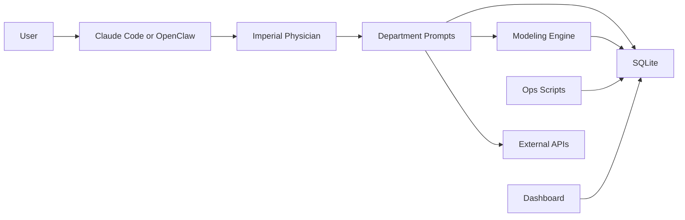
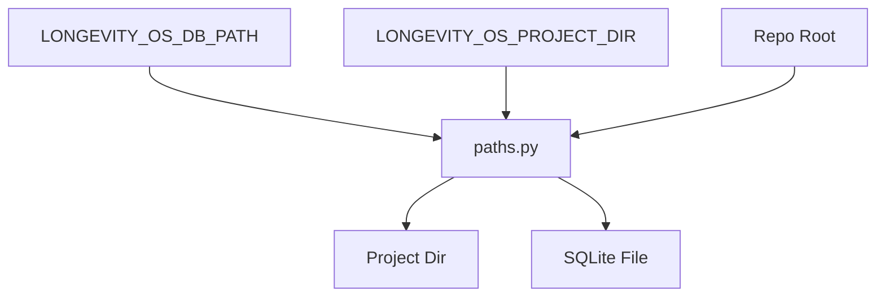
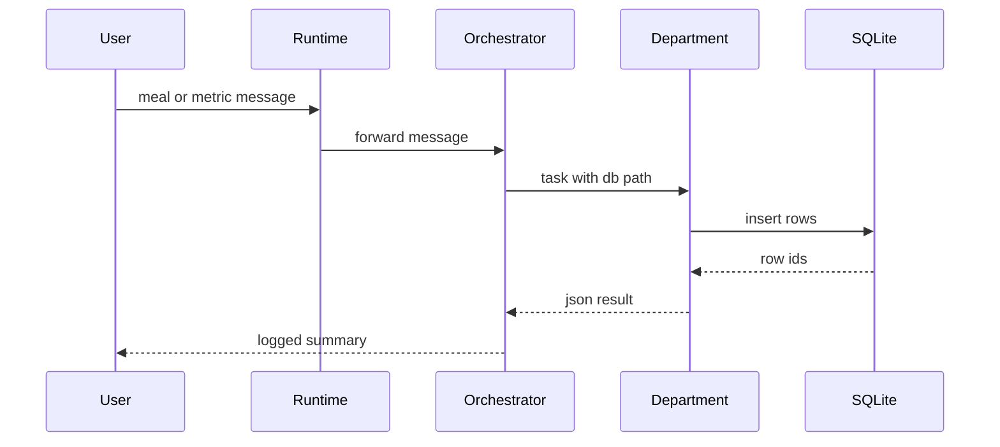
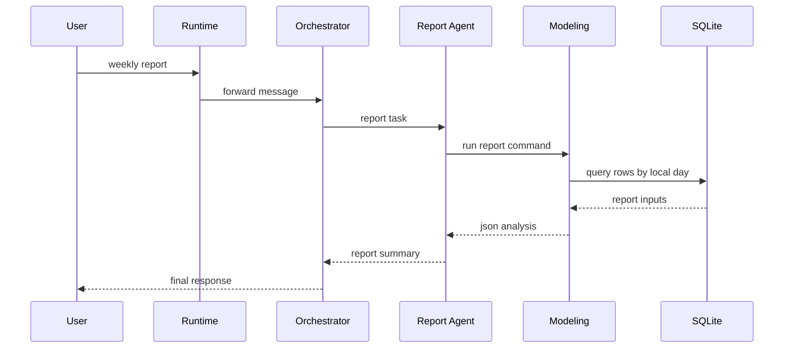
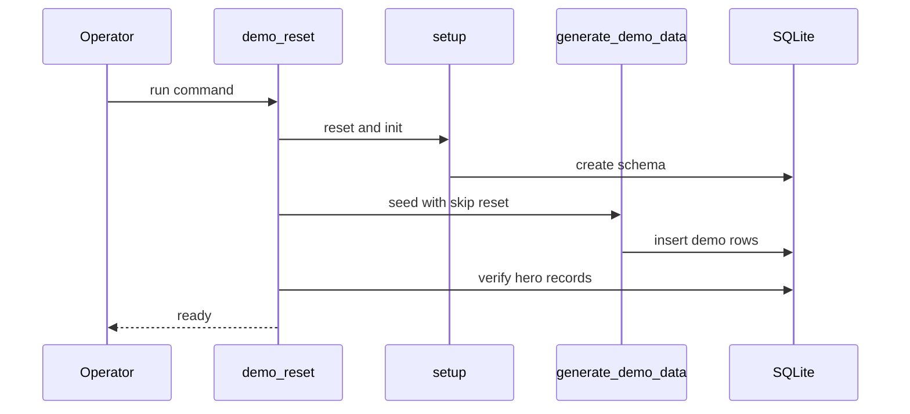
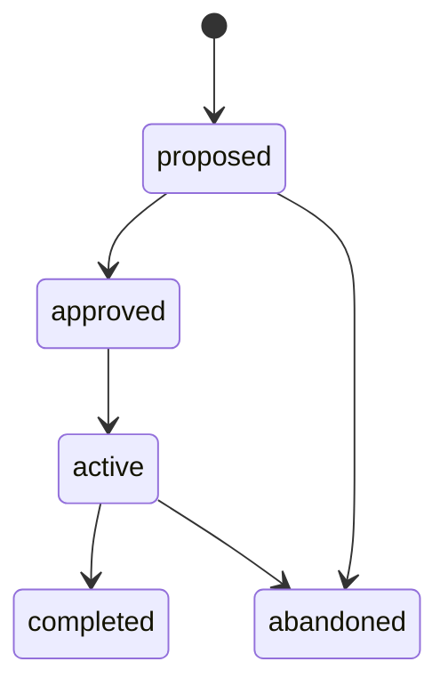
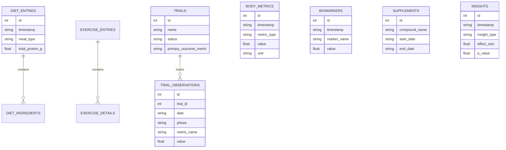

# Longevity OS Architecture Current State

This document explains how Longevity OS works today, what this task changed, and where the real boundaries and handoffs are.

## Scope

This pass focused on three product-readiness problems:

1. Make runtime path resolution deterministic across scripts, modeling code, and prompts.
2. Promote demo seeding into a named reset workflow instead of a hidden primitive.
3. Align read-path date bucketing with the local calendar day stored in the timestamp string.

## System Overview



What it shows: the live system is a prompt-driven orchestrator wrapped around a local SQLite store, with Python scripts acting as the operational spine.

Why it matters: the product impression depends on whether the prompt layer is hitting the same database and date semantics as the scripts and modeling code.

Inputs, outputs, transitions, boundaries, failure paths:

- Input enters as natural language through Claude Code or OpenClaw.
- Control passes from the orchestrator prompt to department prompts.
- Data writes land in SQLite, then read paths and modeling queries pull from the same store.
- Failure usually happens at boundaries: wrong database path, date bucketing mismatch, or a prompt path that does not line up with the script path.

## Subsystem Breakdown

| Subsystem | Owns | Depends On | Exposes | Handoffs |
|---|---|---|---|---|
| `SKILL.md` orchestrator | intent classification, dispatch policy, final response framing | department prompt files, runtime shell access, SQLite path | orchestrator prompt contract | hands user intent to departments; hands database path and context into each task |
| `agents/*.md` | module logic for diet, exercise, metrics, biomarkers, supplements, reports, trials | orchestrator payload, SQLite, modeling CLIs, external MCP tools | JSON response contract | hand back summary, structured data, warnings, and executed SQL |
| `data/db.py` and schema | table definitions, write helpers, query helpers | SQLite, `paths.py` | Python DB API | receives writes from prompts and scripts; serves data to modeling code |
| `modeling/*.py` | trends, anomalies, correlations, causal analysis | SQLite, numpy, pandas, scipy, statsmodels | CLI JSON outputs | consumes stored rows and emits report data, insights, and trial analysis |
| `scripts/*.py` | setup, backup, export, migrations, import flows, demo reset | SQLite, `paths.py`, schema files | operator CLI surface | create/reset/seed the database and verify demo state |
| `dashboard/` | local read-only visualization | SQLite-backed API surface from local files/server | browser UI | reads already-written state; does not own write paths |
| external services | nutrition lookups and literature search | network, MCP runtime | API responses | return ingredient nutrition or paper search results to prompts |

## Ownership And Contracts

### Orchestrator

What it owns:

- top-level routing
- multi-intent splitting
- whether a user gets a write flow, report flow, or trial flow

What it depends on:

- `SKILL.md`
- `agents/*.md`
- the runtime being able to execute shell and agent calls

Interfaces and contracts:

- task payload to department prompts
- department JSON response contract with `status`, `department`, `summary`, `data`, `confidence`, `warnings`, and `sql_executed`

Handoffs:

- passes the resolved database path into department tasks
- collects department outputs and turns them into user-facing prose

### Data Layer

What it owns:

- SQLite schema and indices
- durable storage for all user state
- local date and timestamp storage

What it depends on:

- `data/schema.sql`
- `data/migrations/001_init.sql`
- runtime path resolution from `paths.py`

Interfaces and contracts:

- `TaiYiYuanDB` helper methods in `data/db.py`
- direct SQL from scripts and modeling code

Handoffs:

- receives writes from prompt-driven logging and from seed/import scripts
- hands read access to reports, patterns, causal analysis, dashboard, and export flows

### Modeling Engine

What it owns:

- statistical summaries
- anomaly detection
- cross-module pattern scans
- trial analysis

What it depends on:

- SQLite rows already being present
- Python scientific packages

Interfaces and contracts:

- CLI JSON commands in [`modeling/engine.py`](../modeling/engine.py), [`modeling/patterns.py`](../modeling/patterns.py), and [`modeling/causal.py`](../modeling/causal.py)

Handoffs:

- emits structured analysis consumed by report and trial prompts
- writes model cache and model run rows back into SQLite

### Ops Scripts

What they own:

- database setup and resets
- demo seeding
- export and backup workflows

What they depend on:

- `paths.py`
- schema and migration files
- SQLite availability

Interfaces and contracts:

- CLI commands in [`scripts/setup.py`](../scripts/setup.py), [`scripts/demo_reset.py`](../scripts/demo_reset.py), [`scripts/generate_demo_data.py`](../scripts/generate_demo_data.py), [`scripts/backup.py`](../scripts/backup.py), [`scripts/export.py`](../scripts/export.py), and [`scripts/migrate.py`](../scripts/migrate.py)

Handoffs:

- create and verify the database state before prompts and dashboard read from it
- emit exported datasets for offline review

## Runtime Path Model



What it shows: every Python entrypoint now resolves runtime paths through one module instead of carrying its own absolute path literal.

Why it matters: this was the main source of drift between docs, seed scripts, and read paths.

Inputs, outputs, transitions, boundaries, failure paths:

- input can come from environment overrides or repo-relative defaults
- output is a resolved project directory and database path
- failure happens if different subsystems bypass `paths.py` and hard-code their own locations

## Write Path Sequence



What it shows: the write path is prompt-driven, but durability still depends on real SQL inserts landing in SQLite.

Why it matters: demos fail when the response sounds logged but no rows are actually written.

Inputs, outputs, transitions, boundaries, failure paths:

- input is unstructured text
- output is both persisted state and a confirmation summary
- transition point is the department prompt deciding to write
- failure paths are parsing ambiguity, wrong DB path, or prompt output that never executes the SQL

## Read Path Sequence



What it shows: read flows are multi-hop. They are not direct SQL snippets inside the orchestrator.

Why it matters: the bug fixed in this task lived here. SQLite `DATE(timestamp)` was reading the timestamp in UTC, so the report layer could drift from the local day the writer intended.

Inputs, outputs, transitions, boundaries, failure paths:

- input is a read intent such as `Weekly report`
- output is a synthesized narrative backed by actual rows
- transitions happen from prompt to modeling CLI to SQL
- failure paths include missing scientific Python dependencies and date grouping mismatch

## Demo Reset Sequence



What it shows: the demo workflow is now a named orchestration, not a hidden side effect in the seed script.

Why it matters: this is the operator path reviewers and demos should trust.

Inputs, outputs, transitions, boundaries, failure paths:

- input is one CLI command
- output is a known-good database
- boundary crossings happen between reset, seed, and verification
- failure paths surface immediately if the schema, rows, or hero scenes are missing

## Trial State Machine



What it shows: the minimal lifecycle already encoded in the `trials` table.

Why it matters: trial-related prompts need to respect these state boundaries or the UI and analytics become incoherent.

Inputs, outputs, transitions, boundaries, failure paths:

- proposals come from the trial design flow
- activation requires user approval
- completion and abandonment close the write path for new observations

## Domain Model



What it shows: the important entities for the current demo story, not every table in the schema.

Why it matters: these are the tables involved in the hero scenes and the read/write proof points.

Inputs, outputs, transitions, boundaries, failure paths:

- writes fan into entries, metrics, biomarkers, supplements, and trials
- reads for reports and insights recombine them by day and by module
- trial observations bridge raw behavior and causal analysis

## Relevant Schemas

### Agent Response Object

```json
{
  "status": "success | needs_confirmation | error",
  "department": "shiyi | daoyin | zhenmai | yanfang | bencao | baogao | shixiao | yuanpan | yizheng",
  "summary": "human readable summary",
  "data": {},
  "confidence": 0.0,
  "warnings": [],
  "sql_executed": []
}
```

Why it matters: this is the handoff boundary between department prompts and the orchestrator.

### Runtime Path Inputs

| Input | Meaning | Current Source |
|---|---|---|
| `LONGEVITY_OS_PROJECT_DIR` | mutable data root | environment variable or sibling `longevity-os-data` |
| `LONGEVITY_OS_DB_PATH` | direct SQLite override | environment variable or `{PROJECT_DIR}/data/taiyiyuan.db` |

### Key Table Slices

| Table | Relevant Columns | Why It Matters |
|---|---|---|
| `diet_entries` | `timestamp`, `meal_type`, totals | proves meal logging writes |
| `body_metrics` | `timestamp`, `metric_type`, `value`, `unit` | proves compact metric logging and trend reads |
| `trials` | `name`, `status`, `start_date`, `end_date` | drives active and completed trial views |
| `trial_observations` | `date`, `phase`, `metric_name`, `value`, `compliance_score` | trial status and causal analysis |
| `insights` | `description`, `effect_size`, `p_value`, `trial_candidate` | bridges tracker to insight engine |

## Architectural Boundaries And Handoff Points

| Boundary | Data Handoff | Control Handoff | Main Risk |
|---|---|---|---|
| runtime to orchestrator | raw user utterance | command invocation | wrong skill activation |
| orchestrator to department | task payload plus DB path | intent routing | sounding correct without executing |
| department to SQLite | insert or query SQL | commit point | wrong DB path or malformed SQL |
| SQLite to modeling | grouped time series | report or trial command | local day vs UTC day drift |
| scripts to SQLite | schema reset and seed writes | operator command | hidden destructive side effects |
| dashboard to SQLite | read-only data fetch | page load | stale or partially seeded DB |

## Ambiguities And Mismatches

The following mismatches matter to reviewers:

- Before this task, scripts and modeling modules did not share one runtime path source. The same repo could point at different databases depending on the entrypoint.
- Before this task, many read queries used `DATE(timestamp)`, which bucketed the stored offset timestamp in UTC instead of by the local day encoded in the string.
- `scripts/import_apple_health.py` is still a stub. The architecture should not imply a complete Apple Health ingestion path yet.
- The system prompt in `SKILL.md` previously described initialization and path rules that diverged from the actual Python setup flow. This task aligned the prompt with `scripts/setup.py` and `paths.py`.

## Key Design Decisions

- Use `paths.py` as the runtime path source of truth.
- Prefer a named operator command for demo resets over relying on seed-script side effects.
- Treat the timestamp string prefix as the local calendar day for read-path grouping.
- Keep demo verification explicit and fail fast when hero records are missing.
- Preserve local-only storage as an invariant: SQLite with owner-only permissions and no cloud dependency.

## Invariants

- All entrypoints that touch runtime state should resolve paths through `paths.py`.
- The dashboard and report paths should read from the same database that setup and seed scripts write to.
- Demo reset should always leave behind a usable protein-sleep trial, an active creatine trial, and insight rows that support the README walkthrough.
- Read-path day grouping should match the local day the user intended when the row was written.
