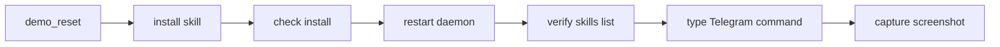
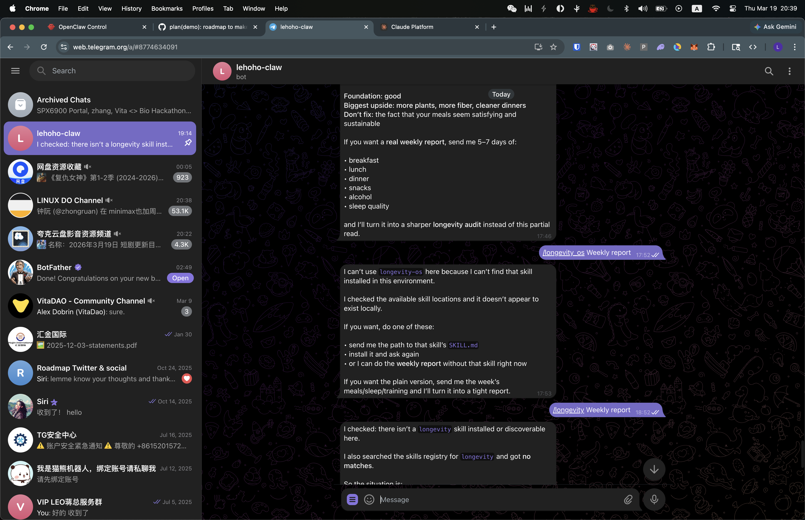
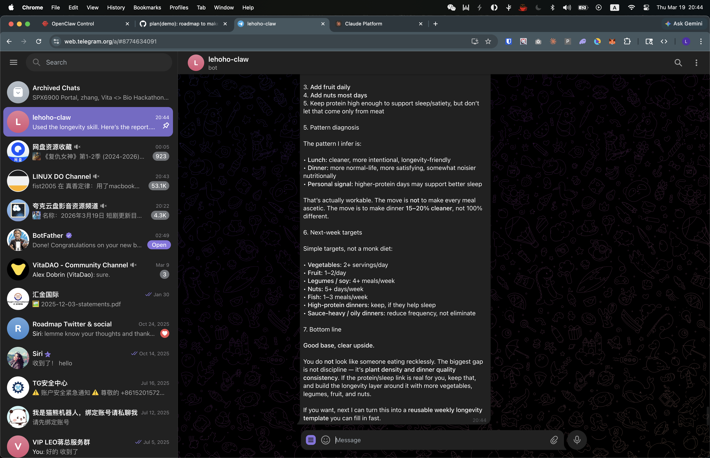
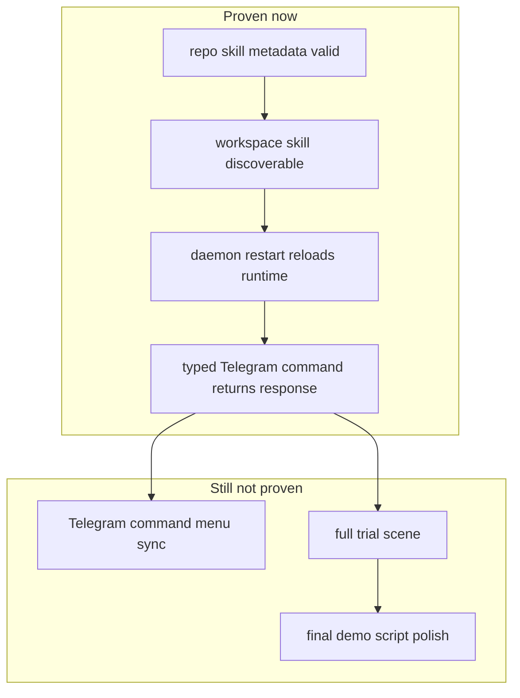

# OpenClaw Telegram Rehearsal Proof

This note records the first real Telegram rehearsal after the repo-side OpenClaw fixes landed.

## What We Tested

- Seed a deterministic runtime database with `python3 scripts/demo_reset.py`
- Verify the rendered workspace skill from this checkout
- Restart OpenClaw so the running gateway reloads the workspace skill metadata
- Send `/longevity Weekly report` in the real Telegram chat
- Capture the before and after screens from Telegram Web

## What Failed Before Restart

Before restarting the daemon, Telegram was still answering from stale runtime state. The chat reply said the `longevity` skill did not exist, even though the repo install and workspace loader were already correct.

Why this matters:

- the repo was already fixed
- `openclaw skills list` showed the workspace skill
- but the running Telegram path was still serving an old view of skill availability

## What Changed After Restart

After `openclaw daemon restart`, the gateway came back, `openclaw skills list` showed `longevity`, and Telegram produced a live weekly-report response.

Supporting runtime signals:

- `openclaw gateway status` returned `RPC probe: ok`
- `openclaw skills list | rg 'longevity|taiyiyuan'` showed `longevity` as `openclaw-workspace`
- `/tmp/openclaw/openclaw-2026-03-19.log` recorded:
  - `telegram sendMessage ok chat=8126535904 message=26`
  - `telegram sendMessage ok chat=8126535904 message=27`

## What This Proves

- The repo-side OpenClaw path is real enough for live rehearsal.
- A typed `/longevity` Telegram command can route and answer on the real chat surface.
- The gateway restart is part of the operator workflow after skill metadata changes.

## What Is Still Broken

Telegram command-menu sync is still flaky on this machine.

Current gateway errors still show repeated failures like:

- `deleteMyCommands failed`
- `setMyCommands failed`
- `deleteWebhook failed`

That means the visible Telegram command menu can lag behind the actual runtime truth. For rehearsal, typed commands are currently more trustworthy than waiting for the bot menu to update.

## Operator Runbook

1. `python3 scripts/demo_reset.py`
2. `python3 scripts/install_openclaw_skill.py --check`
3. `openclaw daemon restart`
4. `openclaw skills list | rg 'longevity|taiyiyuan'`
5. In Telegram, type `/longevity Weekly report`
6. If the menu still looks stale, ignore the menu and trust the typed command result plus the gateway logs
